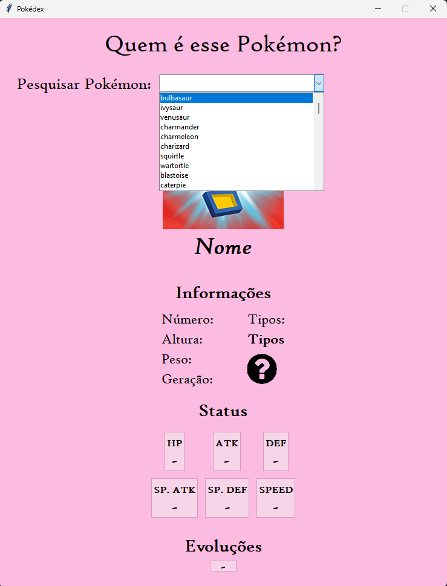

# Pokédex Python API

Aplicação desktop desenvolvida em Python que consome uma API de Pokémon para consultar e exibir informações de diferentes Pokémon.

O projeto foi originalmente desenvolvido durante minha formação técnica e posteriormente refatorado e aprimorado, incluindo melhorias na organização do código, tratamento de erros, pesquisa de Pokémon e interface gráfica.

## ✨ Funcionalidades

- 🔎 Pesquisa de Pokémon por nome
- 📋 Lista de Pokémon obtida através de uma API
- 🖼️ Exibição da imagem do Pokémon
- 📊 Exibição de informações como:
  - Número
  - Altura
  - Peso
  - Geração
  - Tipos
  - HP
  - Ataque
  - Defesa
  - Ataque Especial
  - Defesa Especial
  - Velocidade
- 🧬 Exibição das evoluções
- 🎨 Interface gráfica desenvolvida com Tkinter
- ⚠️ Tratamento de erros de conexão e respostas inválidas da API

## 🛠️ Tecnologias

- Python
- Tkinter
- Requests
- Pillow
- API REST
- Git
- GitHub

## 🔌 APIs utilizadas

### Pokémon API

A aplicação utiliza a API desenvolvida pelo professor Daniel Pimentel para consultar os dados dos Pokémon.

https://pokemon.danielpimentel.com.br/v1/pokemon

### Pokémon Images

As imagens dos Pokémon são obtidas através do repositório de sprites do PokéAPI.

## 📸 Interface

## 📂 Estrutura do projeto
Pokedex Python API/
│
├── Pokedex.py
├── Tipos/
│   ├── Agua.png
│   ├── Fogo.png
│   ├── ...
│
├── requirements.txt
├── .gitignore
└── README.md

## ⚙️ Instalação

* Clone o repositório
    git clone https://github.com/laraisabelysiq/pokedex-python-api.git

* Acesse a pasta do projeto
    cd "Pokedex Python API"

* Instale as dependências
    pip install -r requirements.txt

* Instale as dependências
    python Pokedex.py

## 💡 Sobre o projeto

Este projeto também representa a evolução de uma aplicação desenvolvida durante minha formação técnica.

Durante a refatoração, foram aplicadas melhorias como:

- Organização das funções
- Separação entre lógica da aplicação e interface
- Tratamento de exceções
- Uso de Path para gerenciamento de arquivos
- Requisições HTTP com timeout
- Filtragem dinâmica de Pokémon
- Reutilização de funções
- Melhor organização da interface gráfica

## 👩‍💻 Desenvolvido por

Lara Isabely Alves Siqueira